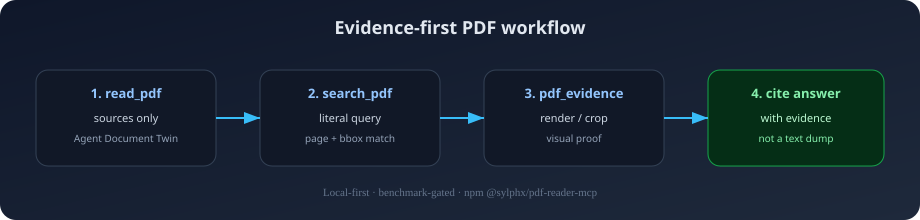

<div align="center">

<p align="center">
  
</p>

# 📄 PDF Reader MCP

### Your agent read the PDF. **Did it read the truth?**

The most-starred PDF MCP server on GitHub.

> **Published stable: `@sylphx/pdf-reader-mcp@3.0.14` (TypeScript path).**  
> Pure-Rust cutover is **in progress and not published**. Versions `3.0.15`–`3.1.1`
> are **WITHDRAWN** (deprecated on npm). Do not install them.  
> **Publish freeze** until capability parity is real — no more premature releases.

[](https://github.com/SylphxAI/pdf-reader-mcp/stargazers)
[](https://www.npmjs.com/package/@sylphx/pdf-reader-mcp)
[](https://opensource.org/licenses/MIT)
[](https://github.com/SylphxAI/pdf-reader-mcp/actions/workflows/ci.yml)
[](https://codecov.io/gh/SylphxAI/pdf-reader-mcp)
[](https://www.rust-lang.org/)
[](https://www.npmjs.com/package/@sylphx/pdf-reader-mcp)
[](#docker)

**Local-first** · **Published: TS 3.0.14** · **Pure-Rust experimental** · **Publish freeze**

[⭐ Star this repo](https://github.com/SylphxAI/pdf-reader-mcp) if agents should cite PDFs with proof, not guess from plain text.
· [Quick start](#quick-start) · [See it work](#see-it-work) · [Roadmap](docs/roadmap/sota-family-roadmap.md) · [Why not plain text?](#why-not-a-plain-text-dump)
</div>

---

## The problem

PDFs are not text files. They are layout, pixels, tables, hidden text, scanned
pages, and reading order that breaks the moment you flatten them.

Most PDF tools give agents a **text dump**. Tables disappear. Scanned pages go
blank. Hidden text sneaks in. Citations become guesses. Then the model
hallucinates — confidently.

**PDF Reader MCP is built for the moment your agent needs to prove an answer, not
just sound plausible.**

## Why not a plain text dump?

| Typical PDF path | PDF Reader MCP |
| --- | --- |
| Dump text into context | Return markdown, chunks, tables, and a linked document map |
| "Trust the summary" | Page numbers, bounding boxes, crop IDs, and render evidence |
| Hope tables survived | Cells, geometry, confidence, warnings, continuation hints |
| Scanned pages silently empty | OCR path with word boxes and provenance |
| No idea what is risky | Trust report for hidden text, spoofing, unsafe links, injection-like content |
| Ship and pray | **39/39** SOTA release-gate checks on every version |

Full capability matrix: [comparison guide](docs/comparison/index.md).

## See it work

**Install once. Call once.**

```bash
claude mcp add pdf-reader -- npx @sylphx/pdf-reader-mcp@3.0.14
```

```json
{
  "sources": [{ "path": "/absolute/path/to/report.pdf" }]
}
```

`read_pdf` inspects the PDF, picks the extraction route, and returns the Agent
Document Twin — no manual `include_*` flags required:

```json
{
  "auto_read": {
    "workflow": "digital_text_route",
    "selected_arguments": {
      "include_markdown": true,
      "include_tables": true,
      "include_chunks": true,
      "include_trust_report": true,
      "include_document_map": true
    }
  },
  "markdown": "# Annual Report 2026\n\n## Executive Summary\n\n...",
  "tables": [
    {
      "page": 5,
      "cells": [
        { "row": 0, "col": 0, "text": "Quarter", "bbox": [72, 650, 180, 670] },
        { "row": 0, "col": 1, "text": "Revenue", "bbox": [200, 650, 300, 670] }
      ],
      "confidence": 0.95
    }
  ],
  "trust_report": { "risk_level": "low", "findings": [] }
}
```

Abbreviated shape — see [full example](examples/agent-document-twin.json) and
[workflows](examples/).

**Search, then verify the source region:**

```json
{
  "sources": [{ "path": "/absolute/path/to/report.pdf" }],
  "query": "revenue recognition",
  "max_matches_per_source": 10
}
```

Use the returned page and bounding box with `pdf_evidence` (`render_page` or
`extract_regions`) when the agent needs visual proof before citing.



## Why agents use it

| Need | What you get |
| --- | --- |
| Read the document | Markdown, JSON, HTML, page text, metadata, chunks, and semantic AST. |
| Prove the answer | Page numbers, bounding boxes, evidence IDs, region crops, and source renders. |
| Handle scanned PDFs | Rendered pages routed through configured OCR providers with word boxes and provenance. |
| Recover tables | Selectable-text and OCR-derived tables with cells, geometry, confidence, warnings, and continuation hints. |
| See what text extraction misses | Visual page evidence, focused crops, and configured visual-region provider adapters. |
| Protect the agent | Trust reports for hidden text, prompt-injection-like content, visual spoofing, unsafe links, and redaction. |
| Route accessibility work | Tagged-PDF coverage, tag-visible coverage, headings, images, forms, links, permissions, and page grades. |
| Ship with proof | CI, package smoke, deterministic quality benchmarks, provider artifacts, and release gates. |

## Quick Start

Install from **npm** (MCP clients) **or crates.io** (Rust / native binary). Same
pure-Rust engine either way.

### npm (MCP clients)

```bash
# Claude Code
claude mcp add pdf-reader -- npx @sylphx/pdf-reader-mcp@3.0.14

# Any MCP client (stdio)
npx @sylphx/pdf-reader-mcp@3.0.14
```

Claude Desktop (`claude_desktop_config.json`):

```json
{
  "mcpServers": {
    "pdf-reader": {
      "command": "npx",
      "args": ["@sylphx/pdf-reader-mcp@3.0.14"]
    }
  }
}
```

The npm package ships a prebuilt native binary (`pdf-reader-mcp-server`). No
Node runtime is required for the MCP path after install.

### crates.io (Rust / cargo)

```bash
# Library: hash, SSRF-safe fetch, read_pdf, search_pdf, document twin builders
cargo add pdf-reader-core

# MCP server binary (stdio / HTTP)
cargo install pdf-reader-mcp-server --locked

# JSON CLI helper
cargo install pdf-reader-cli --locked

# Run MCP over stdio
pdf-reader-mcp-server
```

Programmatic Rust:

```rust
use pdf_reader_core::{read_pdf, ReadPdfInput, ReadPdfSource};

let response = read_pdf(&ReadPdfInput {
    sources: vec![ReadPdfSource {
        path: Some("/absolute/path/to/report.pdf".into()),
        url: None,
        pages: None,
    }],
    include_full_text: true,
    include_markdown: true,
    include_document_map: true,
    include_trust_report: true,
    ..Default::default()
})?;
```

### Docker

```bash
# Pre-built image from GitHub Container Registry
docker run --rm -i -v /path/to/pdfs:/workspace ghcr.io/sylphxai/pdf-reader-mcp

# Or build locally
docker build -t pdf-reader-mcp . && \
  docker run --rm -i -v /path/to/pdfs:/workspace pdf-reader-mcp
```

Need Cursor, VS Code, Windsurf, Cline, Warp, HTTP transport, Docker customization, or
filesystem sandboxing? See the [installation guide](docs/guide/installation.md).

## Pure-Rust status (honest)

Pure-Rust is a **work in progress**, not the published product.

| Claim | Status |
| --- | --- |
| Tool names `read_pdf` / `search_pdf` / `pdf_evidence` | Present in experimental engine |
| Selectable-text extract / search | Partial |
| Full Document Twin (geometry, outline, COS structure) | **Not yet** |
| Evidence `render_page` / crop / OCR / analyze | **Not yet** (fail-closed) |
| Cross-platform npm binary | **Not yet** |
| Drop-in for 3.0.14 | **No** |

See [docs/performance/why-rust.md](docs/performance/why-rust.md). Speedups are exploratory only.

## MCP Tool Surface

| Tool | Use it when the agent needs to... |
| --- | --- |
| `read_pdf` | Use first. With only `sources`, it auto-inspects and reads the PDF in one call; with explicit `include_*` options, it runs precise manual extraction. |
| `search_pdf` | Search selectable text and optional OCR text with snippets, offsets, boxes, and provenance. |
| `pdf_evidence` | One focused evidence tool for `inspect`, `render_page`, `extract_regions`, `ocr_pages`, and `analyze_regions` operations. |

Full request and response details live in the [API reference](docs/api/README.md).

Agents can force `auto: false` for precise manual extraction, or use
`auto_detail: "fast"`, `"balanced"`, or `"full"` to control output depth without
learning dozens of switches.

## Agent Document Twin

The Agent Document Twin is the main reason to use this project instead of a
plain text extractor. It keeps the document readable by agents while preserving
the evidence needed to verify the answer.

| Layer | Output |
| --- | --- |
| Lossless PDF layer | Text runs, lines, words, characters, fonts, transforms, page geometry, metadata coverage, outlines, forms, attachments, annotations, permissions, and structure signals where available. |
| Visual layer | Page renders, region crops, crop provenance, visual candidates, OCR source renders, and provider-normalized visual evidence. |
| Semantic layer | Page, section, paragraph, list, caption, header, footer, table, image, chart, formula, figure, and diagram nodes where available. |
| Evidence layer | Stable IDs, page ranges, bounding boxes, crop IDs, confidence, warnings, and extraction method provenance. |
| Agent layer | Markdown, JSON, HTML, citation chunks, routing plans, trust report, accessibility report, and document map indexes. |

### Example: Read With Evidence

```json
{
  "sources": [{ "path": "/absolute/path/to/report.pdf" }],
  "include_markdown": true,
  "include_chunks": true,
  "include_tables": true,
  "include_text_layer": true,
  "include_document_map": true,
  "include_document_ast": true,
  "include_trust_report": true,
  "include_accessibility_report": true
}
```

## Provider-Enabled Intelligence

The current package stays local-first. The roadmap target is a Rust MCP server
with the same public tool contract, plus optional deployment-controlled
providers for OCR and visual enrichment.

| Capability | Default behavior | Enable with |
| --- | --- | --- |
| Selectable-text PDFs | Works out of the box | No extra dependency |
| Rendering and crops | Works out of the box | No extra dependency |
| Trust and accessibility reports | Works out of the box | No extra dependency |
| OCR for scanned pages | Provider-ready | `MCP_PDF_OCR_*` |
| Visual table/chart/formula/figure/image enrichment | Provider-ready | `MCP_PDF_REGION_ANALYSIS_*` |

Supported visual provider paths include local commands, local HTTP servers,
Ollama, OpenAI-compatible endpoints, LM Studio, and llama.cpp. Request payloads
cannot choose arbitrary executables or arbitrary provider URLs; providers are
configured by the deployment environment.

```bash
# Example shape only. Point these at your own local OCR command.
export MCP_PDF_OCR_COMMAND="tesseract"
export MCP_PDF_OCR_ARGS_JSON='["{input}", "stdout", "tsv"]'
```

See the [guide](docs/guide/index.md) and [API reference](docs/api/README.md)
for provider configuration details.

## Release Proof

Claims are backed by shipped, machine-readable artifacts. Releases do not ship
unless the gate passes.

| Artifact | Current proof |
| --- | --- |
| `pdf_sota_release_gate.json` | `passed`, 39/39 release-gate checks passing |
| `pdf_quality_benchmark.json` | score `1`, 69/69 deterministic quality checks passing |
| `pdf_provider_benchmark.json` | strict provider evidence enabled, 4/4 final-bar provider profiles certified |
| `pdf_corpus_benchmark.json` | corpus-style PDF intelligence assertions with capability summaries |
| `pdf_provider_manifest_crop_benchmark.json` | deterministic crop-substrate proof for provider-manifest regions |
| `pdf_provider_manifest_benchmark.json` | deterministic scoring proof for table, formula, chart, figure, and image regions |

Run the same proof locally:

```bash
bun run benchmark:release-artifacts
bun run benchmark:release-gate
bun run package:smoke
```

See [performance and release evidence](docs/performance/index.md) for the full
benchmark contract.

## Output Formats

`read_pdf` can return the same PDF in several agent-friendly forms:

- Plain text and page text
- Markdown for RAG and summarization
- HTML for rendering or downstream transformation
- Structured elements with page and geometry provenance
- Document AST for semantic navigation
- Citation chunks with page, element, table, and bbox references
- Tables with rows, cells, geometry, warnings, and confidence
- Trust and accessibility reports
- Agent Document Twin indexes linking text, visual, OCR, table, trust, and accessibility evidence

## Security Model

PDFs can contain hostile or misleading content. The server treats extraction as
an evidence workflow, not as a trusted text dump.

- Local-first by default.
- URL loading is guarded by host, private-IP, size, and HTTP policy controls.
- OCR and visual providers are configured by environment, not by request body.
- Trust reports surface hidden text, near-invisible geometry, off-page text,
  overlapping text, unsafe links, redaction signals, and prompt-injection-like
  content.
- Rendering, crops, OCR, and visual enrichment preserve provenance so agents can
  route weak evidence to verification instead of silently trusting it.

## Documentation

| Topic | Link |
| --- | --- |
| Docs site | [sylphxai.github.io/pdf-reader-mcp](https://sylphxai.github.io/pdf-reader-mcp/) |
| Getting started | [docs/guide/getting-started.md](docs/guide/getting-started.md) |
| Installation and clients | [docs/guide/installation.md](docs/guide/installation.md) |
| API reference | [docs/api/README.md](docs/api/README.md) |
| Examples and workflows | [examples/](examples/) |
| Benchmark proof | [docs/benchmark.md](docs/benchmark.md) |
| Why evidence-first PDF reading | [docs/articles/evidence-first.md](docs/articles/evidence-first.md) |
| Stop PDF hallucinations (agent builders) | [docs/articles/stop-pdf-hallucinations.md](docs/articles/stop-pdf-hallucinations.md) |
| Capability overview | [docs/comparison/index.md](docs/comparison/index.md) |
| Architecture and design | [docs/design/index.md](docs/design/index.md) |
| Performance and release proof | [docs/performance/index.md](docs/performance/index.md) |

## Development

```bash
git clone https://github.com/SylphxAI/pdf-reader-mcp.git
cd pdf-reader-mcp
bun install
bun run build
bun test
```

Useful checks:

```bash
bun run check
bun run typecheck
bun run docs:build
bun run package:smoke
bun run benchmark:release-gate
```

## Support

- [Issues](https://github.com/SylphxAI/pdf-reader-mcp/issues)
- [Discussions](https://github.com/SylphxAI/pdf-reader-mcp/discussions)
- [npm package](https://www.npmjs.com/package/@sylphx/pdf-reader-mcp)

## Help this reach more builders

If PDF hallucinations have wasted your context, your citations, or your trust in
agent output, you are exactly who this project is for.

**[⭐ Star the repo](https://github.com/SylphxAI/pdf-reader-mcp)** — it is the
fastest way to help more agent builders find evidence-first PDF reading. Share
it in your MCP client setup, team wiki, or agent stack README.

### Discovery (in progress)

| Channel | Status |
| --- | --- |
| [Glama MCP directory](https://glama.ai/mcp/servers/SylphxAI/pdf-reader-mcp) | Listed — [claim server](https://glama.ai/mcp/servers/SylphxAI/pdf-reader-mcp/admin) for full discoverability |
| [Official MCP Registry](https://registry.modelcontextprotocol.io/v0.1/servers?search=io.github.SylphxAI/pdf-reader-mcp) | Listed — `io.github.SylphxAI/pdf-reader-mcp` @ v3.1.0 |
| [TensorBlock MCP Index PR #1113](https://github.com/TensorBlock/awesome-mcp-servers/pull/1113) | Open — multimedia/document processing listing |
| [MCP servers community issue #4500](https://github.com/modelcontextprotocol/servers/issues/4500) | Open — community server highlight |
| [mcp.so listing issue #3068](https://github.com/chatmcp/mcpso/issues/3068) | Open — directory submission request |
| [appcypher/awesome-mcp-servers compare](https://github.com/appcypher/awesome-mcp-servers/compare/main...SylphxAI:add-pdf-reader-mcp) | Branch ready — upstream PRs disabled |
| [mcpservers.org submit](https://mcpservers.org/submit) | Not listed yet — free web-form submission |

Know another MCP directory? [Open an issue](https://github.com/SylphxAI/pdf-reader-mcp/issues/new) with the link.

## License

MIT © [SylphxAI](https://github.com/SylphxAI)

## Star History

[](https://star-history.com/#SylphxAI/pdf-reader-mcp&Date)
