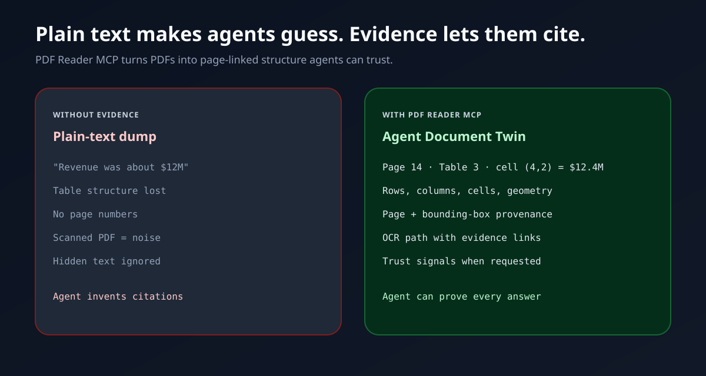

<!-- Marketing surface: scannable pitch first; engineering docs below the fold. -->
<div align="center">

# Citra

### Give your AI agent eyes for PDFs — with proof.

**Local-first PDF evidence for agents.** Structured text, tables, OCR, visual crops, and page-level citations your agent can **defend** — not invent.

**Canonical package** [`@sylphx/citra`](https://www.npmjs.com/package/@sylphx/citra) · **bin** `citra` · **MCP** `io.github.SylphxAI/citra` · **live** `5.0.0`

[](https://www.npmjs.com/package/@sylphx/citra)
[](https://opensource.org/licenses/MIT)
[](https://github.com/SylphxAI/pdf-reader-mcp/stargazers)

</div>

## Zero-config in one line

```bash
npx -y @sylphx/citra
```

No Docker. No API key. No global install. Spawns a **stdio MCP server** agents can use immediately.

| Client | Setup |
| --- | --- |
| **Any agent / CLI** | `npx -y @sylphx/citra` |
| **Claude Code** | `claude mcp add citra -- npx -y @sylphx/citra` |
| **Claude Desktop / Cursor / VS Code / Codex** | `"command": "npx", "args": ["-y", "@sylphx/citra"]` |
| **Global CLI** | `npm i -g @sylphx/citra` → `citra` |

## Why Citra feels unfairly good

Plain-text PDF tools make agents **guess**. Citra returns an **Agent Document Twin** they can **cite**.

| Pain today | With Citra |
| --- | --- |
| Page numbers invented or missing | **Page + geometry + provenance** |
| Tables flattened into soup | **Rows · columns · cells · bounding boxes** |
| Scanned PDFs become noise | **OCR path linked to evidence** |
| Install / config / “hope it works” | **`npx -y` — done** |
| Silent engine fallbacks | **Fail closed** if the native binary is missing |

### Five reasons teams pick Citra

1. **Zero-config** — real `npx` MCP, not a 20-step bootstrap.
2. **Evidence, not vibes** — citations agents can show a human.
3. **Local-first** — PDFs stay on the machine; no required cloud vision API.
4. **Brand-sole** — one package, one bin, one story (`@sylphx/citra` / `citra`).
5. **Instrument family** — compose with Iris (image), Cue (video), Spine, Lookout, Locus.

## See the difference



| Without evidence | With Citra |
| --- | --- |
| “Revenue was about $12M” | “Page 14, Table 3, cell (row 4, col 2) = `$12.4M`” |
| Lost table structure | Rows, columns, cells, bounding boxes |
| Scanned PDF = garbage text | OCR with page-linked evidence |
| Hidden / adversarial text ignored | Trust signals when requested |

## What you get

Three tools. One product surface.

| Tool | What agents use it for |
| --- | --- |
| `read_pdf` | Smart default: markdown, tables, structure, OCR, citations |
| `search_pdf` | Find page + snippet matches before deep reading |
| `pdf_evidence` | Crops, renders, inspect, focused evidence ops |

Minimal call:

```json
{
  "sources": [{ "path": "/absolute/path/to/report.pdf" }]
}
```

### Flagship use cases

1. **Financial reports** — extract table cells agents can cite by page and geometry  
2. **Research papers** — headings, reading order, page-level quotes  
3. **Scanned documents** — OCR path with evidence, not a text soup  

## Platforms

One **optional** native package is selected for **your** host only:

| Platform | Native package |
| --- | --- |
| macOS arm64 | `@sylphx/citra-darwin-arm64` |
| macOS x64 | `@sylphx/citra-darwin-x64` |
| Linux x64 | `@sylphx/citra-linux-x64-gnu` |
| Linux arm64 | `@sylphx/citra-linux-arm64-gnu` |
| Windows x64 | `@sylphx/citra-win32-x64-msvc` |

Missing native → **fail closed** (no silent TypeScript PDF engine).

## Product docs

| Doc | Purpose |
| --- | --- |
| [docs/POSITIONING.md](docs/POSITIONING.md) | Strategic positioning |
| [docs/COMPETITIVE.md](docs/COMPETITIVE.md) | Peer anchors and wedge |
| [docs/EVIDENCE_CONTRACT.md](docs/EVIDENCE_CONTRACT.md) | Evidence = result contract |
| [docs/TOOL_SURFACE.md](docs/TOOL_SURFACE.md) | Few clear tools policy |
| [docs/PRODUCT_INDEPENDENCE.md](docs/PRODUCT_INDEPENDENCE.md) | This repo is SSOT |
| [docs/IPPB.md](docs/IPPB.md) | Independent public product bar |
| [docs/PUBLISH.md](docs/PUBLISH.md) | npm / git publish status |
| [docs/guide/installation.md](docs/guide/installation.md) | Install & host config |
| [skills/citra/SKILL.md](./skills/citra/SKILL.md) | Agent skill surface |

## Surfaces (MCP · CLI · SDK)

**MCP (default agent path)**

```bash
npx -y @sylphx/citra
```

**Claude Desktop / Cursor / VS Code / Codex**

```json
{
  "mcpServers": {
    "citra": {
      "command": "npx",
      "args": ["-y", "@sylphx/citra"]
    }
  }
}
```

Dual-era hosts that send `server/discover` before `initialize` (e.g. Gemini Antigravity CLI) are supported on stdio.

**CLI**

```bash
npx -y @sylphx/citra --help
```

**SDK**

- `@sylphx/citra/sdk` → `Citra` (`read` / `search` / `evidence`)
- `@sylphx/citra/pure-rust` → low-level client helpers  
- Same tools as MCP: `read_pdf` · `search_pdf` · `pdf_evidence`  
- Requires the platform optional native package (same as MCP)

## Install footprint (honest)

Compare **full clean installs**, not “JS wrapper tarball vs native executable”:

| Metric (measured clean install, **linux-x64**) | Historical TS `3.0.14` | Sole-Rust `4.1.0` lineage |
| --- | ---: | ---: |
| Main package on disk | ~403 KB | ~77 KB |
| Full `node_modules` | ~82.3 MiB | **~24.4 MiB** (~3.4× smaller) |
| Installed files | 4,101 | **20** (~205× fewer) |
| Production npm deps | PDF.js + MCP TS SDK + more | `{}` + **one** platform native |

The native binary is multi-megabyte because it **is** the PDF engine. That is expected — and still a **cleaner install** than shipping PDF.js + a large JS tree.

Details: [installed footprint comparison](docs/specs/performance/installed-footprint-comparison.md)

## Performance (method-bounded)

Controlled **same-host linux-x64** dual-mode A/B vs historical `@sylphx/pdf-reader-mcp@3.0.14`, using **registry-installed sole-Rust natives** (measured on the 4.1.x lineage; method applies to current sole-Rust packages):

| Mode | What it measures | Result |
| --- | --- | --- |
| `persistent_warm` | long-lived server, repeated identical local `read_pdf` after warm-up | **≥ ~10×** median latency improvement on all 8 required fixture classes |
| `startup_inclusive` | spawn + initialize + one task | large advantage on the same fixtures |

`persistent_warm` includes a process-local cache for identical local path+options. First request in a process still pays full parse cost.

**Not** a multi-host guarantee. Details: [4.1.0 report](docs/specs/performance/4.1.0-same-host-performance-report.md) · [claims policy](docs/specs/performance/4.1.0-performance-claims-policy.md)

## Engine note

Current production is a **native Rust engine** on supported platforms via a thin Node launcher.

> Local-first. Five platform packages. One clean install. Fail closed without the matching native.

Unusually formed or broken ToUnicode CMaps are handled without crashing; the release binary is panic-unwind so a worker-thread panic fails the request instead of aborting the process ([#608](https://github.com/SylphxAI/pdf-reader-mcp/issues/608)).

Engineering history and recovery pins: [docs/migration.md](docs/migration.md) — not the product pitch.

## Product proof & links

- [Website / guide](https://sylphxai.github.io/pdf-reader-mcp/)
- [Product proof](docs/guide/product-proof.md)
- [Benchmark](docs/benchmark.md)
- [Installation](docs/guide/installation.md)
- [npm](https://www.npmjs.com/package/@sylphx/citra)

---

<div align="center">

**Stop PDF hallucinations. Give agents proof.**

```bash
npx -y @sylphx/citra
```

</div>
