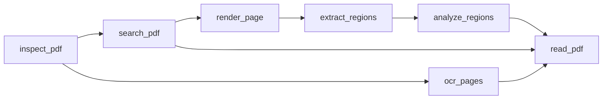

<div align="center">

# 📄 @sylphx/pdf-reader-mcp

> The PDF intelligence layer for AI agents that need source evidence, not just extracted text.

[](https://www.npmjs.com/package/@sylphx/pdf-reader-mcp)
[](https://opensource.org/licenses/MIT)
[](https://github.com/SylphxAI/pdf-reader-mcp/actions/workflows/ci.yml)
[](https://codecov.io/gh/SylphxAI/pdf-reader-mcp)
[](https://www.typescriptlang.org/)
[](https://www.npmjs.com/package/@sylphx/pdf-reader-mcp)

**Agent Document Twin** · **Evidence-first extraction** · **Visual crops** · **OCR adapters** · **Tables, charts, formulas, figures** · **Trust & accessibility reports** · **Benchmark-gated releases**

<a href="https://mseep.ai/app/SylphxAI-pdf-reader-mcp">

</a>

</div>

---

PDFs are not plain text files. They are layout, pixels, tables, hidden text,
permissions, annotations, scanned pages, and ambiguous reading order.

PDF Reader MCP turns that mess into an **Agent Document Twin**: a linked,
source-backed representation of the PDF that agents can inspect, search,
verify, crop, OCR, enrich, cite, and read with confidence.

If your agent has ever hallucinated from a PDF, lost a table, trusted hidden
text, missed a scanned page, or needed to cite the exact region that proves an
answer, this is the MCP server for that workflow.

## Why Agents Use It

| Need | What PDF Reader MCP gives you |
| --- | --- |
| Read the document | Markdown, JSON, HTML, page text, metadata, chunks, and semantic AST. |
| Prove the answer | Page numbers, bounding boxes, evidence IDs, region crops, and source renders. |
| Handle scanned PDFs | Rendered pages routed through configured OCR providers with word boxes and provenance. |
| Recover tables | Selectable-text and OCR-derived tables with cells, geometry, confidence, warnings, and continuation hints. |
| See what text extraction misses | Visual page evidence, focused crops, and configured visual-region provider adapters. |
| Protect the agent | Trust reports for hidden text, prompt-injection-like content, visual spoofing, unsafe links, and redaction. |
| Route accessibility work | Tagged-PDF coverage, tag-visible coverage, headings, images, forms, links, permissions, and page grades. |
| Ship with proof | CI, package smoke, deterministic quality benchmarks, provider artifacts, and release gates. |

## Quick Start

### Claude Code

```bash
claude mcp add pdf-reader -- npx @sylphx/pdf-reader-mcp
```

### Claude Desktop

Add this to `claude_desktop_config.json`:

```json
{
  "mcpServers": {
    "pdf-reader": {
      "command": "npx",
      "args": ["@sylphx/pdf-reader-mcp"]
    }
  }
}
```

### Any MCP Client

```bash
npx @sylphx/pdf-reader-mcp
```

Node.js `>=22.13` is required. The default package works without downloading
OCR models, vision models, Ollama, LM Studio, llama.cpp, or cloud credentials.

Need Cursor, VS Code, Windsurf, Cline, Warp, HTTP transport, Docker, or
filesystem sandboxing? See the [installation guide](docs/guide/installation.md).

## The Agent Workflow

Most PDF tools start by dumping text. This server starts by helping the agent
decide what evidence it needs.



1. `inspect_pdf` profiles the PDF and recommends the next tools.
2. `search_pdf` finds source-backed text matches before spending context.
3. `render_page` returns visual page evidence.
4. `extract_regions` crops precise PDF-coordinate regions.
5. `ocr_pages` recovers scanned-page text through a configured local OCR provider.
6. `analyze_regions` enriches crops through configured local visual providers.
7. `read_pdf` returns the linked Agent Document Twin.

## MCP Tool Surface

| Tool | Use it when the agent needs to... |
| --- | --- |
| `inspect_pdf` | Classify a PDF, detect scanned or low-text risk, check provider readiness, and get a routing plan. |
| `search_pdf` | Search selectable text and optional OCR text with snippets, offsets, boxes, and provenance. |
| `render_page` | Render pages as bounded PNG image parts with JSON provenance. |
| `extract_regions` | Crop focused regions for tables, charts, formulas, figures, annotations, and citations. |
| `analyze_regions` | Normalize local provider output for tables, formulas, charts, figures, and image descriptions. |
| `ocr_pages` | Run rendered pages through configured OCR and return text, confidence, word boxes, and render evidence. |
| `read_pdf` | Extract text, Markdown, HTML, chunks, tables, trust reports, accessibility reports, OCR evidence, visual enrichments, and the document twin. |

Full request and response details live in the [API reference](docs/api/README.md).

## Agent Document Twin

The Agent Document Twin is the main reason to use this project instead of a
plain text extractor. It keeps the document readable by agents while preserving
the evidence needed to verify the answer.

| Layer | Output |
| --- | --- |
| Lossless PDF layer | Text runs, lines, words, characters, fonts, transforms, page geometry, metadata coverage, outlines, forms, attachments, annotations, permissions, and structure signals where available. |
| Visual layer | Page renders, region crops, crop provenance, visual candidates, OCR source renders, and provider-normalized visual evidence. |
| Semantic layer | Page, section, paragraph, list, caption, header, footer, table, image, chart, formula, figure, and diagram nodes where available. |
| Evidence layer | Stable IDs, page ranges, bounding boxes, crop IDs, confidence, warnings, and extraction method provenance. |
| Agent layer | Markdown, JSON, HTML, citation chunks, routing plans, trust report, accessibility report, and document map indexes. |

### Example: Read With Evidence

```json
{
  "path": "/absolute/path/to/report.pdf",
  "include_markdown": true,
  "include_chunks": true,
  "include_tables": true,
  "include_text_layer": true,
  "include_document_map": true,
  "include_document_ast": true,
  "include_trust_report": true,
  "include_accessibility_report": true
}
```

### Example: Search, Then Verify The Source Region

```json
{
  "path": "/absolute/path/to/report.pdf",
  "query": "revenue recognition",
  "include_bounding_boxes": true
}
```

Use the returned page and bounding box with `render_page` or `extract_regions`
when the agent needs visual proof before citing or summarizing.

## Provider-Enabled Intelligence

The default package stays TypeScript-first and local-first. Heavy engines are
optional, deployment-controlled adapters.

| Capability | Default behavior | Enable with |
| --- | --- | --- |
| Selectable-text PDFs | Works out of the box | No extra dependency |
| Rendering and crops | Works out of the box | No extra dependency |
| Trust and accessibility reports | Works out of the box | No extra dependency |
| OCR for scanned pages | Provider-ready | `MCP_PDF_OCR_*` |
| Visual table/chart/formula/figure/image enrichment | Provider-ready | `MCP_PDF_REGION_ANALYSIS_*` |

Supported visual provider paths include local commands, local HTTP servers,
Ollama, OpenAI-compatible endpoints, LM Studio, and llama.cpp. Request payloads
cannot choose arbitrary executables or arbitrary provider URLs; providers are
configured by the deployment environment.

```bash
# Example shape only. Point these at your own local OCR command.
export MCP_PDF_OCR_COMMAND="tesseract"
export MCP_PDF_OCR_ARGS='["{input}", "stdout", "tsv"]'
```

See the [guide](docs/guide/index.md) and [API reference](docs/api/README.md)
for provider configuration details.

## Release Proof

Strong README claims should be backed by shipped evidence. This repo publishes
machine-readable artifacts and gates releases on them.

| Artifact | Current proof |
| --- | --- |
| `pdf_sota_release_gate.json` | `passed`, 39/39 release-gate checks passing |
| `pdf_quality_benchmark.json` | score `1`, 69/69 deterministic quality checks passing |
| `pdf_provider_benchmark.json` | strict provider evidence enabled, 4/4 final-bar provider profiles certified |
| `pdf_corpus_benchmark.json` | corpus-style PDF intelligence assertions with capability summaries |
| `pdf_provider_manifest_crop_benchmark.json` | deterministic crop-substrate proof for provider-manifest regions |
| `pdf_provider_manifest_benchmark.json` | deterministic scoring proof for table, formula, chart, figure, and image regions |

Run the same proof locally:

```bash
bun run benchmark:release-artifacts
bun run benchmark:release-gate
bun run package:smoke
```

See [performance and release evidence](docs/performance/index.md) for the full
benchmark contract.

## Output Formats

`read_pdf` can return the same PDF in several agent-friendly forms:

- Plain text and page text
- Markdown for RAG and summarization
- HTML for rendering or downstream transformation
- Structured elements with page and geometry provenance
- Document AST for semantic navigation
- Citation chunks with page, element, table, and bbox references
- Tables with rows, cells, geometry, warnings, and confidence
- Trust and accessibility reports
- Agent Document Twin indexes linking text, visual, OCR, table, trust, and accessibility evidence

## Security Model

PDFs can contain hostile or misleading content. The server treats extraction as
an evidence workflow, not as a trusted text dump.

- Local-first by default.
- URL loading is guarded by host, private-IP, size, and HTTP policy controls.
- OCR and visual providers are configured by environment, not by request body.
- Trust reports surface hidden text, near-invisible geometry, off-page text,
  overlapping text, unsafe links, redaction signals, and prompt-injection-like
  content.
- Rendering, crops, OCR, and visual enrichment preserve provenance so agents can
  route weak evidence to verification instead of silently trusting it.

## Documentation

| Topic | Link |
| --- | --- |
| Getting started | [docs/guide/getting-started.md](docs/guide/getting-started.md) |
| Installation and clients | [docs/guide/installation.md](docs/guide/installation.md) |
| API reference | [docs/api/README.md](docs/api/README.md) |
| Capability overview | [docs/comparison/index.md](docs/comparison/index.md) |
| Architecture and design | [docs/design/index.md](docs/design/index.md) |
| Performance and release proof | [docs/performance/index.md](docs/performance/index.md) |

## Development

```bash
git clone https://github.com/SylphxAI/pdf-reader-mcp.git
cd pdf-reader-mcp
bun install
bun run build
bun test
```

Useful checks:

```bash
bun run check
bun run typecheck
bun run docs:build
bun run package:smoke
bun run benchmark:release-gate
```

## Support

- [Issues](https://github.com/SylphxAI/pdf-reader-mcp/issues)
- [Discussions](https://github.com/SylphxAI/pdf-reader-mcp/discussions)
- [npm package](https://www.npmjs.com/package/@sylphx/pdf-reader-mcp)

If you want local-first, evidence-backed PDF intelligence to keep improving for
AI agents, star the repo. It helps the project reach more builders who need
PDFs to be verifiable, not just readable.

## License

MIT © [SylphxAI](https://github.com/SylphxAI)

## Star History

[](https://star-history.com/#SylphxAI/pdf-reader-mcp&Date)
